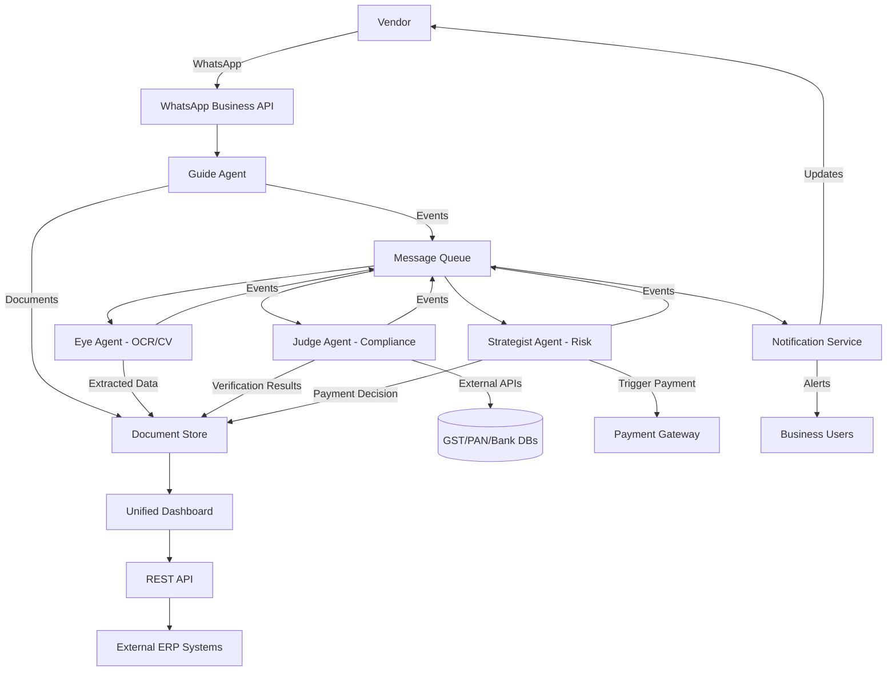
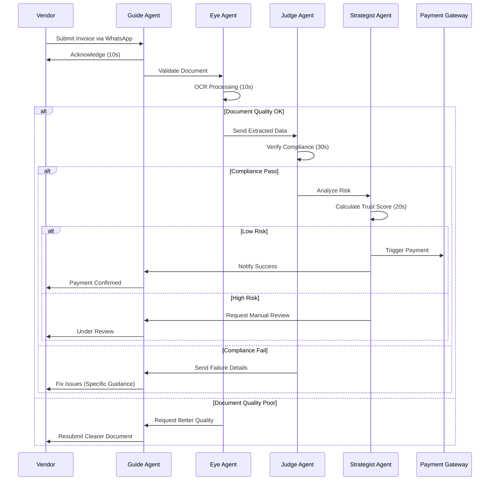

# Design Document: VendorReady

## Overview

VendorReady is built as a microservices-based architecture with four autonomous AI agents working in a coordinated pipeline. The system processes vendor invoice submissions through a series of validation, verification, and decision stages, reducing processing time from 30-45 days to 15 minutes.

The architecture follows an event-driven design where each agent operates independently, communicating through a message queue system. This ensures scalability, fault tolerance, and the ability to process multiple submissions concurrently.

### Key Design Principles

1. **Agent Autonomy**: Each AI agent operates independently with clear responsibilities
2. **Event-Driven Communication**: Agents communicate through asynchronous events
3. **Fail-Fast Validation**: Issues are caught and reported immediately at each stage
4. **Audit-First Design**: Every decision and action is logged for compliance
5. **Vendor-Centric UX**: WhatsApp interface provides familiar, accessible interaction
6. **Zero-Trust Security**: All data is encrypted, all actions are authenticated

## Architecture

### High-Level System Architecture



### Agent Pipeline Flow



## Components and Interfaces

### 1. Guide Agent (Collection & Communication)

**Responsibilities:**
- Vendor interaction via WhatsApp Business API
- Document collection and initial validation
- Contextual guidance and issue resolution
- Notification delivery to vendors

**Core Interfaces:**

```typescript
interface GuideAgent {
  // Vendor interaction
  handleIncomingMessage(vendorId: string, message: Message): Promise<Response>
  acknowledgeSubmission(submissionId: string): Promise<void>
  requestDocument(vendorId: string, documentType: DocumentType): Promise<void>
  
  // Feedback and guidance
  notifyValidationFailure(submissionId: string, issues: ValidationIssue[]): Promise<void>
  notifySuccess(submissionId: string, paymentDetails: PaymentInfo): Promise<void>
  provideGuidance(vendorId: string, context: ConversationContext): Promise<string>
  
  // Document handling
  validateFileFormat(file: File): boolean
  storeDocument(submissionId: string, document: Document): Promise<string>
}

interface Message {
  id: string
  vendorId: string
  content: string
  attachments: File[]
  timestamp: Date
}

interface Response {
  text: string
  quickReplies?: string[]
  requiresAction: boolean
}
```

**Key Algorithms:**

1. **Context-Aware Response Generation**
   - Maintain conversation state per vendor
   - Track submission stage and required documents
   - Generate responses based on current context and vendor history

2. **Multi-Language Support**
   - Detect language from vendor messages
   - Translate responses to vendor's preferred language (English/Hindi)

### 2. Eye Agent (Document Validation)

**Responsibilities:**
- OCR processing of submitted documents
- Computer vision for quality assessment
- Field extraction and data structuring
- Tampering detection

**Core Interfaces:**

```typescript
interface EyeAgent {
  // OCR and extraction
  processDocument(documentId: string): Promise<ExtractionResult>
  extractFields(documentId: string): Promise<ExtractedData>
  
  // Quality validation
  assessDocumentQuality(documentId: string): Promise<QualityScore>
  detectTampering(documentId: string): Promise<TamperingReport>
  
  // Field identification
  identifyInvoiceFields(text: string): Promise<InvoiceFields>
  validateFieldCompleteness(fields: InvoiceFields): ValidationResult
}

interface ExtractionResult {
  documentId: string
  extractedText: string
  confidence: number
  fields: ExtractedData
  quality: QualityScore
  tamperingDetected: boolean
}

interface ExtractedData {
  invoiceNumber: string
  invoiceDate: Date
  amount: number
  currency: string
  gstNumber: string
  panNumber: string
  bankDetails: BankInfo
  vendorName: string
  vendorAddress: string
}

interface QualityScore {
  overall: number // 0-100
  readability: number
  completeness: number
  clarity: number
  issues: string[]
}
```

**Key Algorithms:**

1. **OCR Processing Pipeline**
   - Pre-process image (deskew, denoise, enhance contrast)
   - Apply OCR engine (Tesseract or cloud-based OCR)
   - Post-process text (spell correction, format normalization)
   - Extract structured fields using regex and NLP

2. **Quality Assessment**
   - Calculate image resolution and clarity metrics
   - Detect blur, shadows, and distortions
   - Assess text readability using confidence scores
   - Flag documents below quality threshold

3. **Tampering Detection**
   - Analyze image metadata for editing software signatures
   - Detect inconsistent fonts or formatting
   - Check for copy-paste artifacts
   - Verify digital signatures if present

### 3. Judge Agent (Compliance Verification)

**Responsibilities:**
- GST number verification against government database
- PAN number verification
- Bank account validation
- Cross-reference verification
- Compliance scoring

**Core Interfaces:**

```typescript
interface JudgeAgent {
  // Verification operations
  verifyGST(gstNumber: string): Promise<GSTVerificationResult>
  verifyPAN(panNumber: string): Promise<PANVerificationResult>
  verifyBankAccount(accountDetails: BankInfo): Promise<BankVerificationResult>
  
  // Cross-reference checks
  crossReferenceGSTPAN(gstNumber: string, panNumber: string): Promise<boolean>
  verifyNameMatch(extractedName: string, officialName: string): Promise<MatchResult>
  
  // Compliance scoring
  calculateComplianceScore(verificationResults: VerificationResults): ComplianceScore
  generateComplianceReport(submissionId: string): Promise<ComplianceReport>
}

interface GSTVerificationResult {
  valid: boolean
  registeredName: string
  registrationDate: Date
  status: 'Active' | 'Cancelled' | 'Suspended'
  address: string
  businessType: string
}

interface PANVerificationResult {
  valid: boolean
  name: string
  category: 'Individual' | 'Company' | 'Firm' | 'Trust'
  status: 'Active' | 'Inactive'
}

interface BankVerificationResult {
  valid: boolean
  accountHolderName: string
  accountType: string
  ifscValid: boolean
  bankName: string
}

interface ComplianceScore {
  overall: number // 0-100
  gstScore: number
  panScore: number
  bankScore: number
  crossReferenceScore: number
  passed: boolean
  issues: ComplianceIssue[]
}
```

**Key Algorithms:**

1. **GST Verification**
   - Call GST API with rate limiting and retry logic
   - Parse response and extract business details
   - Validate GST format and checksum
   - Cache results for 24 hours to reduce API calls

2. **Name Matching Algorithm**
   - Normalize names (remove punctuation, convert to lowercase)
   - Calculate Levenshtein distance for fuzzy matching
   - Handle common variations (Pvt Ltd, Private Limited, etc.)
   - Apply threshold-based matching (>85% similarity = match)

3. **Compliance Scoring**
   - Weight each verification component (GST: 40%, PAN: 30%, Bank: 20%, Cross-ref: 10%)
   - Calculate weighted average
   - Apply penalties for missing or invalid data
   - Generate pass/fail decision based on threshold (>80% = pass)

### 4. Strategist Agent (Risk Analysis & Decision)

**Responsibilities:**
- Vendor risk profile analysis
- Trust score calculation
- Payment decision automation
- Risk-based routing (auto-pay vs manual review)

**Core Interfaces:**

```typescript
interface StrategistAgent {
  // Risk analysis
  analyzeRisk(submissionId: string, vendorId: string): Promise<RiskAnalysis>
  calculateTrustScore(vendorId: string): Promise<TrustScore>
  
  // Decision making
  makePaymentDecision(riskAnalysis: RiskAnalysis): PaymentDecision
  routeForReview(submissionId: string, reason: string): Promise<void>
  
  // Payment triggering
  triggerPayment(submissionId: string, amount: number): Promise<PaymentResult>
  
  // Learning and adaptation
  updateVendorProfile(vendorId: string, outcome: TransactionOutcome): Promise<void>
}

interface RiskAnalysis {
  submissionId: string
  vendorId: string
  trustScore: number
  complianceScore: number
  invoiceAmount: number
  riskLevel: 'Low' | 'Medium' | 'High'
  factors: RiskFactor[]
  recommendation: 'AutoPay' | 'ManualReview' | 'Reject'
}

interface TrustScore {
  overall: number // 0-100
  paymentHistory: number
  complianceHistory: number
  transactionVolume: number
  relationshipDuration: number
  disputeRate: number
  tier: 'Platinum' | 'Gold' | 'Silver' | 'Bronze' | 'New'
}

interface PaymentDecision {
  approved: boolean
  automatic: boolean
  reason: string
  conditions: string[]
  reviewRequired: boolean
}
```

**Key Algorithms:**

1. **Trust Score Calculation**
   ```
   TrustScore = (
     PaymentHistory * 0.30 +
     ComplianceHistory * 0.25 +
     TransactionVolume * 0.20 +
     RelationshipDuration * 0.15 +
     (100 - DisputeRate) * 0.10
   )
   
   Where:
   - PaymentHistory: % of on-time payments
   - ComplianceHistory: Average compliance score
   - TransactionVolume: Normalized transaction count
   - RelationshipDuration: Months as vendor (capped at 24)
   - DisputeRate: % of transactions with disputes
   ```

2. **Risk-Based Decision Tree**
   ```
   IF TrustScore >= 80 AND ComplianceScore >= 90 AND Amount <= AutoPayLimit:
     DECISION = AutoPay
   ELSE IF TrustScore >= 60 AND ComplianceScore >= 80:
     DECISION = ManualReview
   ELSE:
     DECISION = Reject (with guidance for improvement)
   ```

3. **Adaptive Learning**
   - Track payment outcomes (successful, disputed, fraudulent)
   - Adjust trust score weights based on prediction accuracy
   - Update risk thresholds based on business policies
   - Learn vendor behavior patterns over time

### 5. Document Store

**Responsibilities:**
- Secure storage of all documents and extracted data
- Version control for document updates
- Audit trail maintenance
- Data retention and archival

**Core Interfaces:**

```typescript
interface DocumentStore {
  // Document operations
  storeDocument(document: Document, metadata: DocumentMetadata): Promise<string>
  retrieveDocument(documentId: string): Promise<Document>
  updateDocument(documentId: string, updates: Partial<Document>): Promise<void>
  
  // Data operations
  storeExtractedData(submissionId: string, data: ExtractedData): Promise<void>
  retrieveSubmissionData(submissionId: string): Promise<SubmissionData>
  
  // Audit trail
  logEvent(event: AuditEvent): Promise<void>
  getAuditTrail(submissionId: string): Promise<AuditEvent[]>
  
  // Search and query
  searchSubmissions(criteria: SearchCriteria): Promise<Submission[]>
  getVendorHistory(vendorId: string): Promise<VendorHistory>
}

interface DocumentMetadata {
  submissionId: string
  vendorId: string
  documentType: DocumentType
  uploadedAt: Date
  fileSize: number
  mimeType: string
  checksum: string
}

interface AuditEvent {
  id: string
  submissionId: string
  timestamp: Date
  actor: string // Agent or User ID
  action: string
  details: Record<string, any>
  outcome: 'Success' | 'Failure'
}
```

### 6. Unified Dashboard

**Responsibilities:**
- Real-time vendor and submission status display
- Financial analytics and reporting
- Manual review interface
- User management and access control

**Core Interfaces:**

```typescript
interface UnifiedDashboard {
  // Vendor management
  getVendorList(filters: VendorFilters): Promise<VendorSummary[]>
  getVendorDetails(vendorId: string): Promise<VendorProfile>
  updateVendorSettings(vendorId: string, settings: VendorSettings): Promise<void>
  
  // Submission tracking
  getActiveSubmissions(): Promise<SubmissionStatus[]>
  getSubmissionDetails(submissionId: string): Promise<SubmissionDetails>
  approveSubmission(submissionId: string, userId: string): Promise<void>
  rejectSubmission(submissionId: string, reason: string, userId: string): Promise<void>
  
  // Financial analytics
  getCashFlowSummary(dateRange: DateRange): Promise<CashFlowData>
  getPaymentTimeline(dateRange: DateRange): Promise<PaymentSchedule>
  generateFinancialReport(reportType: ReportType, params: ReportParams): Promise<Report>
  
  // User management
  createUser(userData: UserData): Promise<User>
  updateUserRole(userId: string, role: Role): Promise<void>
  getUserPermissions(userId: string): Promise<Permission[]>
}

interface VendorSummary {
  vendorId: string
  name: string
  trustScore: number
  complianceStatus: 'Compliant' | 'Issues' | 'Pending'
  totalTransactions: number
  totalAmount: number
  lastTransaction: Date
}

interface SubmissionStatus {
  submissionId: string
  vendorName: string
  amount: number
  currentStage: 'Collection' | 'Validation' | 'Compliance' | 'Risk Analysis' | 'Payment' | 'Complete'
  status: 'In Progress' | 'Pending Review' | 'Approved' | 'Rejected'
  submittedAt: Date
  estimatedCompletion: Date
}
```

### 7. Message Queue System

**Responsibilities:**
- Event routing between agents
- Guaranteed message delivery
- Dead letter queue for failed processing
- Event replay for debugging

**Technology:** Apache Kafka or AWS SQS/SNS

**Event Types:**
- `document.uploaded`
- `validation.completed`
- `compliance.verified`
- `risk.analyzed`
- `payment.triggered`
- `submission.completed`
- `review.required`

### 8. Notification Service

**Responsibilities:**
- Multi-channel notification delivery (Email, SMS, WhatsApp, In-app)
- Notification preferences management
- Delivery tracking and retry logic
- Template management

**Core Interfaces:**

```typescript
interface NotificationService {
  sendNotification(notification: Notification): Promise<DeliveryResult>
  sendBulkNotifications(notifications: Notification[]): Promise<DeliveryResult[]>
  
  getUserPreferences(userId: string): Promise<NotificationPreferences>
  updatePreferences(userId: string, preferences: NotificationPreferences): Promise<void>
  
  getDeliveryStatus(notificationId: string): Promise<DeliveryStatus>
}

interface Notification {
  recipientId: string
  channel: 'Email' | 'SMS' | 'WhatsApp' | 'InApp'
  template: string
  data: Record<string, any>
  priority: 'High' | 'Normal' | 'Low'
}
```

## Data Models

### Core Entities

```typescript
// Vendor Entity
interface Vendor {
  id: string
  name: string
  gstNumber: string
  panNumber: string
  bankDetails: BankInfo
  contactInfo: ContactInfo
  trustScore: TrustScore
  tier: VendorTier
  status: 'Active' | 'Suspended' | 'Inactive'
  createdAt: Date
  updatedAt: Date
}

interface BankInfo {
  accountNumber: string
  ifscCode: string
  accountHolderName: string
  bankName: string
  branchName: string
  accountType: 'Savings' | 'Current'
}

interface ContactInfo {
  primaryContact: string
  email: string
  phone: string
  whatsappNumber: string
  address: Address
}

// Submission Entity
interface Submission {
  id: string
  vendorId: string
  invoiceNumber: string
  amount: number
  currency: string
  submittedAt: Date
  completedAt?: Date
  status: SubmissionStatus
  currentStage: ProcessingStage
  documents: DocumentReference[]
  extractedData: ExtractedData
  verificationResults: VerificationResults
  riskAnalysis: RiskAnalysis
  paymentInfo?: PaymentInfo
  auditTrail: AuditEvent[]
}

type SubmissionStatus = 
  | 'Submitted'
  | 'Validating'
  | 'Verifying'
  | 'Analyzing'
  | 'Approved'
  | 'Rejected'
  | 'PendingReview'
  | 'PaymentProcessing'
  | 'Completed'

type ProcessingStage = 
  | 'Collection'
  | 'Validation'
  | 'Compliance'
  | 'RiskAnalysis'
  | 'Payment'
  | 'Complete'

// Transaction Entity
interface Transaction {
  id: string
  submissionId: string
  vendorId: string
  amount: number
  currency: string
  paymentMethod: string
  paymentGateway: string
  transactionDate: Date
  status: 'Pending' | 'Processing' | 'Completed' | 'Failed'
  referenceNumber: string
  fees: number
  netAmount: number
}

// User Entity
interface User {
  id: string
  email: string
  name: string
  role: Role
  permissions: Permission[]
  organizationId: string
  status: 'Active' | 'Inactive'
  lastLogin: Date
  createdAt: Date
}

type Role = 
  | 'Admin'
  | 'FinanceManager'
  | 'ComplianceOfficer'
  | 'Viewer'

type Permission = 
  | 'vendor.view'
  | 'vendor.edit'
  | 'submission.view'
  | 'submission.approve'
  | 'submission.reject'
  | 'payment.trigger'
  | 'report.generate'
  | 'user.manage'
  | 'settings.edit'
```

### Database Schema Design

**Primary Database:** PostgreSQL for transactional data
**Document Store:** MongoDB or S3 for document storage
**Cache Layer:** Redis for session management and frequently accessed data
**Search Engine:** Elasticsearch for full-text search and analytics

**Key Tables:**
- `vendors` - Vendor master data
- `submissions` - Invoice submission records
- `transactions` - Payment transaction records
- `documents` - Document metadata and references
- `audit_logs` - Complete audit trail
- `users` - User accounts and authentication
- `notifications` - Notification queue and history

**Indexes:**
- `vendors(gst_number)` - Fast GST lookup
- `submissions(vendor_id, status)` - Vendor submission queries
- `submissions(submitted_at)` - Time-based queries
- `transactions(vendor_id, transaction_date)` - Payment history
- `audit_logs(submission_id, timestamp)` - Audit trail queries

## Data Flow Example: Complete Submission Journey

1. **Vendor Submits Invoice (t=0s)**
   - Vendor sends invoice via WhatsApp
   - Guide Agent receives message, validates format
   - Document stored in Document Store with unique submission ID
   - Event `document.uploaded` published to Message Queue
   - Vendor receives acknowledgment with submission ID

2. **Document Validation (t=10s)**
   - Eye Agent consumes `document.uploaded` event
   - Performs OCR processing and field extraction
   - Assesses document quality and detects tampering
   - Stores extracted data in Document Store
   - Publishes `validation.completed` event (success or failure)

3. **Compliance Verification (t=40s)**
   - Judge Agent consumes `validation.completed` event
   - Verifies GST, PAN, and bank details against external databases
   - Performs cross-reference checks
   - Calculates compliance score
   - Stores verification results in Document Store
   - Publishes `compliance.verified` event

4. **Risk Analysis (t=60s)**
   - Strategist Agent consumes `compliance.verified` event
   - Retrieves vendor history and calculates trust score
   - Analyzes risk factors and makes payment decision
   - Stores risk analysis in Document Store
   - Publishes `risk.analyzed` event

5. **Payment Decision (t=80s)**
   - If auto-approved: Strategist triggers payment via Payment Gateway
   - If manual review: Notification sent to finance team
   - Payment status updated in Document Store
   - Vendor notified via Guide Agent
   - Event `submission.completed` published

6. **Post-Processing (t=90s)**
   - Audit trail finalized
   - Analytics updated
   - Vendor trust score updated
   - Dashboard refreshed with new data


## Correctness Properties

*A property is a characteristic or behavior that should hold true across all valid executions of a system—essentially, a formal statement about what the system should do. Properties serve as the bridge between human-readable specifications and machine-verifiable correctness guarantees.*

### Property 1: Acknowledgment Timing

*For any* vendor message sent to the WhatsApp interface, the Guide_Agent should acknowledge receipt within 10 seconds.

**Validates: Requirements 1.1**

### Property 2: File Format Validation

*For any* submitted document, if the file format is not in the supported list (PDF, JPEG, PNG, common image formats), the Guide_Agent should reject it and request resubmission in a supported format.

**Validates: Requirements 1.2**

### Property 3: Unique Submission IDs

*For any* completed document submission, the Guide_Agent should generate a unique submission ID that is different from all previously generated IDs.

**Validates: Requirements 1.3**

### Property 4: Missing Document Detection

*For any* incomplete submission, the Guide_Agent should identify all missing required documents and request them from the vendor.

**Validates: Requirements 1.5**

### Property 5: Field Extraction Completeness

*For any* valid invoice document processed by the Eye_Agent, the extracted data should contain all required fields (invoice number, date, amount, GST number, PAN, bank details).

**Validates: Requirements 2.4**

### Property 6: Compliance Verification Sequence

*For any* submission with extracted data, the Judge_Agent should perform GST verification before PAN verification, and both should complete before generating the compliance score.

**Validates: Requirements 3.2**

### Property 7: Name Matching Validation

*For any* submission with bank details, if the account holder name does not match the vendor name (with fuzzy matching threshold >85%), the Judge_Agent should flag a compliance failure.

**Validates: Requirements 3.3**

### Property 8: GST-PAN Cross-Reference

*For any* submission, if the GST number and PAN number do not belong to the same entity according to government databases, the Judge_Agent should mark the submission as non-compliant.

**Validates: Requirements 3.4**

### Property 9: Failure Report Generation

*For any* submission that fails verification, the Judge_Agent should generate a detailed failure report containing specific issues for each failed verification check.

**Validates: Requirements 3.5**

### Property 10: Compliance Score Calculation

*For any* submission, the compliance score should be calculated as a weighted average of verification results (GST: 40%, PAN: 30%, Bank: 20%, Cross-ref: 10%) and should be deterministic for the same input data.

**Validates: Requirements 3.6**

### Property 11: Compliant Submission Marking

*For any* submission where all verifications pass and the compliance score exceeds 80%, the Judge_Agent should mark the submission as compliant.

**Validates: Requirements 3.7**

### Property 12: Trust Score Calculation

*For any* vendor, the Trust_Score should be calculated using the formula: PaymentHistory(30%) + ComplianceHistory(25%) + TransactionVolume(20%) + RelationshipDuration(15%) + (100-DisputeRate)(10%), and should produce consistent results for the same input data.

**Validates: Requirements 4.2, 9.1**

### Property 13: Automatic Payment Triggering

*For any* submission where Trust_Score exceeds the configured threshold AND compliance score passes, the Strategist_Agent should trigger automatic payment processing without manual review.

**Validates: Requirements 4.3**

### Property 14: Manual Review Routing

*For any* submission where Trust_Score is below the configured threshold OR compliance score fails, the Strategist_Agent should route the submission for human approval.

**Validates: Requirements 4.4**

### Property 15: Risk Calculation Factors

*For any* two submissions that differ only in invoice amount, vendor history, or compliance score, the risk analysis results should differ, demonstrating that all factors influence the calculation.

**Validates: Requirements 4.5**

### Property 16: Resubmission Workflow

*For any* submission that fails at a specific stage, when the vendor resubmits corrected documents, processing should resume from the failed stage rather than restarting from the beginning.

**Validates: Requirements 5.3**

### Property 17: Conversation Context Preservation

*For any* vendor with multiple message exchanges, the Guide_Agent should maintain context such that responses reference previous interactions and the current submission state.

**Validates: Requirements 5.4**

### Property 18: Review Timeline Communication

*For any* submission flagged for manual review, the Guide_Agent should provide the vendor with an estimated review timeline in the notification.

**Validates: Requirements 5.5**

### Property 19: Payment Gateway Integration

*For any* payment triggered by the Strategist_Agent, the platform should initiate a payment request to the configured payment gateway with correct vendor and amount details.

**Validates: Requirements 6.1**

### Property 20: Payment History Updates

*For any* completed payment transaction, the vendor's payment history should be updated to include the transaction with timestamp, amount, and status.

**Validates: Requirements 6.3**

### Property 21: Payment Retry Logic

*For any* failed payment, the platform should retry according to the configured retry policy (number of attempts and intervals) and notify the finance team after final failure.

**Validates: Requirements 6.4**

### Property 22: Payment Receipt Generation

*For any* successful payment, the platform should generate a payment confirmation receipt containing transaction details and vendor information.

**Validates: Requirements 6.6**

### Property 23: Vendor List Completeness

*For any* set of vendors in the system, the Unified_Dashboard should display all vendors in the list view with their current compliance status.

**Validates: Requirements 7.1**

### Property 24: Vendor Profile Data

*For any* vendor selected in the dashboard, the detailed view should include Trust_Score, complete payment history, and all compliance records.

**Validates: Requirements 7.2**

### Property 25: Real-Time Status Updates

*For any* submission status change, the Unified_Dashboard should reflect the updated status within 5 seconds for users viewing that submission.

**Validates: Requirements 7.3**

### Property 26: Vendor Search and Filtering

*For any* search query or filter applied to the vendor list, the results should include only vendors matching the specified criteria (name, compliance status, or payment status).

**Validates: Requirements 7.4**

### Property 27: Vendor Performance Analytics

*For any* vendor, the dashboard should calculate and display average processing time and rejection rate based on their complete transaction history.

**Validates: Requirements 7.5**

### Property 28: Manual Approval Actions

*For any* submission flagged for review, when a user approves or rejects it, the submission status should update accordingly and trigger the appropriate next action (payment or vendor notification).

**Validates: Requirements 7.6**

### Property 29: Cash Flow Calculation

*For any* point in time, the dashboard should calculate current cash flow as the sum of all pending payables minus pending receivables.

**Validates: Requirements 8.1**

### Property 30: Payment Timeline Accuracy

*For any* date range, the payment timeline should include all scheduled payment obligations with correct amounts and due dates.

**Validates: Requirements 8.2**

### Property 31: Invoice Aging Calculation

*For any* vendor, the aging report should correctly calculate days outstanding as the difference between current date and invoice date for unpaid invoices.

**Validates: Requirements 8.3**

### Property 32: Days Payable Outstanding

*For any* time period, the DPO metric should be calculated as (Average Accounts Payable / Cost of Goods Sold) × Number of Days in Period.

**Validates: Requirements 8.4**

### Property 33: Budget vs Actual Analysis

*For any* vendor category with a configured budget, the dashboard should calculate variance as (Actual Spending - Budget) and display percentage over/under budget.

**Validates: Requirements 8.6**

### Property 34: Trust Score Updates

*For any* vendor, successful transactions should increase Trust_Score while compliance issues or disputes should decrease Trust_Score, with changes proportional to the severity of the event.

**Validates: Requirements 9.2, 9.3**

### Property 35: Vendor Risk Tier Categorization

*For any* vendor, their risk tier should be determined by Trust_Score ranges: Platinum (90-100), Gold (80-89), Silver (70-79), Bronze (60-69), New (<60).

**Validates: Requirements 9.4**

### Property 36: Tier-Based Processing Rules

*For any* two vendors in different risk tiers, the processing rules applied (auto-pay limits, review requirements) should differ according to their tier.

**Validates: Requirements 9.5**

### Property 37: Trust Score Trend Display

*For any* vendor with historical Trust_Score changes, the dashboard should display a trend showing score values over time with timestamps.

**Validates: Requirements 9.6**

### Property 38: Comprehensive Audit Logging

*For any* agent decision, user action, or system event, the platform should create an immutable audit log entry containing timestamp, actor, action, details, and outcome.

**Validates: Requirements 4.7, 6.5, 10.1, 11.4**

### Property 39: Audit Record Immutability

*For any* audit record or document submission record, once created, it should not be modifiable—any attempt to update should create a new version while preserving the original.

**Validates: Requirements 10.2**

### Property 40: Compliance Report Accuracy

*For any* time period, compliance reports should accurately reflect verification success rates and average processing times calculated from all submissions in that period.

**Validates: Requirements 10.3**

### Property 41: Role-Based Access Control

*For any* user, the dashboard should display only sections and actions that are permitted by their assigned role's permissions.

**Validates: Requirements 11.2, 14.3**

### Property 42: Custom Role Creation

*For any* administrator, they should be able to create a custom role with a specific subset of permissions, and users assigned that role should have exactly those permissions.

**Validates: Requirements 11.3**

### Property 43: Account Lockout Policy

*For any* user account, after 5 consecutive failed login attempts, the account should be automatically locked and require administrator intervention to unlock.

**Validates: Requirements 11.6**

### Property 44: System Load Alerting

*For any* time when system resource utilization exceeds 80% capacity, the platform should send an alert to administrators within 1 minute.

**Validates: Requirements 12.5**

### Property 45: Webhook Event Triggering

*For any* key event (submission completion, payment processing, compliance failure), if webhooks are configured, the platform should trigger webhook notifications to all registered endpoints.

**Validates: Requirements 13.2**

### Property 46: API Rate Limiting

*For any* API client, if the number of requests exceeds the configured rate limit within the time window, subsequent requests should be rejected with HTTP 429 status until the window resets.

**Validates: Requirements 13.4**

### Property 47: Data Deletion Compliance

*For any* data deletion request for a vendor, all personally identifiable information should be removed from the system while preserving anonymized transaction records for compliance.

**Validates: Requirements 14.4**

### Property 48: Analytics Data Anonymization

*For any* analytics report or aggregate data view, personally identifiable information (names, contact details, account numbers) should be anonymized or excluded.

**Validates: Requirements 14.5**

### Property 49: Notification Preference Enforcement

*For any* user with configured notification preferences, they should only receive notifications for event types they have enabled in their preferences.

**Validates: Requirements 15.3**

### Property 50: Event-Driven Notifications

*For any* critical event (payment failure, manual review required, compliance failure), the platform should send notifications to the appropriate recipients through their preferred channels within the specified time limits.

**Validates: Requirements 4.6, 15.4**

### Property 51: Daily Summary Reports

*For any* configured recipient, the platform should generate and send a daily summary report containing processing metrics (submissions processed, success rate, average time, pending reviews) at the scheduled time.

**Validates: Requirements 15.5**

### Property 52: Issue Escalation

*For any* unresolved issue (pending review, failed payment, stuck submission), if it remains unresolved beyond the configured time threshold, the platform should escalate it to the next level of management.

**Validates: Requirements 15.6**

## Error Handling

### Error Categories

1. **Validation Errors**
   - Invalid file formats
   - Missing required fields
   - Poor document quality
   - **Handling:** Immediate feedback to vendor with specific guidance

2. **Verification Errors**
   - GST/PAN database unavailable
   - Invalid credentials
   - Mismatched data
   - **Handling:** Retry with exponential backoff, fallback to manual review if persistent

3. **System Errors**
   - Payment gateway failures
   - Database connection issues
   - Message queue failures
   - **Handling:** Automatic retry, circuit breaker pattern, alert operations team

4. **Business Logic Errors**
   - Duplicate submissions
   - Insufficient funds
   - Policy violations
   - **Handling:** Clear error messages, route to appropriate handler

### Error Recovery Strategies

**Retry Policies:**
- External API calls: 3 retries with exponential backoff (1s, 2s, 4s)
- Payment processing: 5 retries over 24 hours
- Message queue: Infinite retries with dead letter queue after 10 attempts

**Circuit Breaker:**
- Open circuit after 5 consecutive failures
- Half-open state after 30 seconds
- Close circuit after 3 successful requests

**Graceful Degradation:**
- If GST API unavailable: Allow manual verification override
- If OCR fails: Route to manual data entry
- If payment gateway down: Queue payments for later processing

**Error Logging:**
- All errors logged with full context (submission ID, vendor ID, stack trace)
- Critical errors trigger immediate alerts
- Error patterns analyzed for system improvements

## Testing Strategy

### Dual Testing Approach

VendorReady requires both unit testing and property-based testing for comprehensive coverage:

**Unit Tests** focus on:
- Specific examples of valid and invalid inputs
- Edge cases (empty documents, malformed data, boundary values)
- Integration points between agents and external services
- Error conditions and exception handling
- Mock external dependencies (GST API, payment gateways)

**Property-Based Tests** focus on:
- Universal properties that hold for all inputs
- Comprehensive input coverage through randomization
- Invariants that must be maintained across operations
- Round-trip properties (serialization/deserialization)
- State machine properties (workflow transitions)

### Property-Based Testing Configuration

**Framework Selection:**
- **Python:** Hypothesis
- **TypeScript/JavaScript:** fast-check
- **Java:** jqwik

**Test Configuration:**
- Minimum 100 iterations per property test (due to randomization)
- Seed-based reproducibility for failed tests
- Shrinking enabled to find minimal failing examples
- Timeout: 30 seconds per property test

**Property Test Tagging:**
Each property-based test must include a comment referencing the design document property:

```python
# Feature: vendor-ready, Property 12: Trust Score Calculation
@given(payment_history=floats(0, 100), compliance_history=floats(0, 100), ...)
def test_trust_score_calculation(payment_history, compliance_history, ...):
    score = calculate_trust_score(payment_history, compliance_history, ...)
    assert 0 <= score <= 100
    # Verify deterministic calculation
    score2 = calculate_trust_score(payment_history, compliance_history, ...)
    assert score == score2
```

### Test Coverage Requirements

**Unit Test Coverage:**
- Minimum 80% code coverage
- 100% coverage for critical paths (payment processing, compliance verification)
- All error handling paths tested

**Property Test Coverage:**
- All 52 correctness properties implemented as property-based tests
- Each acceptance criterion with "yes - property" in prework has corresponding test
- Integration tests for agent pipeline flow

### Testing Pyramid

```
         /\
        /  \  E2E Tests (10%)
       /____\  - Complete submission workflows
      /      \ - Multi-agent integration
     /________\ Integration Tests (20%)
    /          \ - Agent interactions
   /____________\ - External API mocking
  /              \ Unit + Property Tests (70%)
 /________________\ - Individual components
                    - Business logic
                    - Data transformations
```

### Continuous Testing

- All tests run on every commit
- Property tests run with different random seeds in CI/CD
- Performance tests run nightly
- Security tests run weekly
- Load tests run before major releases

### Test Data Generation

**For Property-Based Tests:**
- Generate random vendor data (names, GST numbers, PAN numbers)
- Generate random invoice documents with varying quality
- Generate random transaction histories
- Use realistic distributions (amounts follow power law, dates are recent)

**For Unit Tests:**
- Curated examples covering common cases
- Edge cases (zero amounts, very large amounts, special characters)
- Known failure scenarios from production incidents

### Mocking Strategy

**External Dependencies to Mock:**
- WhatsApp Business API
- GST verification API
- PAN verification API
- Bank verification API
- Payment gateways
- Message queue (use in-memory queue for tests)

**Mock Behavior:**
- Simulate API latency and timeouts
- Simulate rate limiting
- Simulate various error responses
- Provide deterministic responses for reproducibility

## Security Considerations

### Authentication and Authorization

- OAuth 2.0 for API access
- JWT tokens with 1-hour expiration
- Refresh tokens with 30-day expiration
- Multi-factor authentication for dashboard users
- Role-based access control with principle of least privilege

### Data Protection

- TLS 1.3 for all data in transit
- AES-256 encryption for data at rest
- Encryption keys rotated quarterly
- Separate encryption keys per customer
- Key management via AWS KMS or similar

### Compliance

- GDPR compliance for data handling
- PCI DSS compliance for payment processing
- SOC 2 Type II certification
- Regular security audits and penetration testing
- Incident response plan with 24-hour notification

### Threat Mitigation

**Injection Attacks:**
- Parameterized queries for all database operations
- Input validation and sanitization
- Content Security Policy headers

**DDoS Protection:**
- Rate limiting at API gateway
- CloudFlare or similar DDoS protection
- Auto-scaling to handle traffic spikes

**Data Breaches:**
- Encryption at rest and in transit
- Access logging and monitoring
- Anomaly detection for unusual access patterns
- Regular backup with encryption

**Insider Threats:**
- Audit logging of all data access
- Separation of duties
- Background checks for employees with data access
- Automated alerts for suspicious activity

## Deployment Architecture

### Infrastructure

**Cloud Provider:** AWS (can be adapted to Azure/GCP)

**Core Services:**
- **Compute:** ECS/EKS for containerized agents
- **Database:** RDS PostgreSQL (Multi-AZ)
- **Document Storage:** S3 with versioning
- **Message Queue:** Amazon SQS/SNS or Kafka
- **Cache:** ElastiCache Redis
- **Search:** Amazon OpenSearch
- **API Gateway:** AWS API Gateway with WAF

### Scalability Design

**Horizontal Scaling:**
- Each agent runs as independent microservice
- Auto-scaling based on queue depth and CPU utilization
- Load balancer distributes traffic across instances

**Database Scaling:**
- Read replicas for dashboard queries
- Connection pooling to optimize database connections
- Caching layer (Redis) for frequently accessed data
- Partitioning by customer ID for large datasets

**Message Queue Scaling:**
- Separate queues per agent for isolation
- Dead letter queues for failed messages
- Priority queues for urgent submissions

### High Availability

- Multi-AZ deployment for all critical services
- Database failover with automatic promotion
- Health checks and automatic instance replacement
- Circuit breakers to prevent cascade failures
- Graceful degradation when services are unavailable

### Monitoring and Observability

**Metrics:**
- Processing time per stage
- Success/failure rates
- Queue depths
- API latency
- Error rates by type

**Logging:**
- Structured logging (JSON format)
- Centralized log aggregation (CloudWatch/ELK)
- Log retention: 90 days hot, 7 years cold storage
- Correlation IDs for request tracing

**Alerting:**
- PagerDuty integration for critical alerts
- Slack notifications for warnings
- Alert on: high error rates, slow processing, queue backlog, system resource exhaustion

**Tracing:**
- Distributed tracing with AWS X-Ray or Jaeger
- Trace complete submission journey across agents
- Performance bottleneck identification

## Future Enhancements (Phase 2 & 3)

### Phase 2: Unified Economic Dashboard (Months 4-9)

**Inventory Management:**
- Track inventory levels across vendors
- Automated reorder points
- Inventory valuation and aging

**Expense Tracking:**
- Categorize expenses automatically
- Budget tracking and alerts
- Spend analytics by category/vendor

**Cash Flow Forecasting:**
- ML-based cash flow predictions
- Scenario analysis (best/worst case)
- Working capital optimization

**Multi-Service Integration:**
- Procurement system integration
- Accounting software sync (Tally, QuickBooks)
- Bank account aggregation

### Phase 3: Complete Ecosystem (Year 1+)

**Bank Integrations:**
- Real-time account balance visibility
- Instant credit line access based on receivables
- Automated loan applications

**NBFC Partnerships:**
- Invoice discounting marketplace
- Vendor financing options
- Supply chain financing

**Supply Chain Visibility:**
- Track orders from PO to delivery
- Vendor performance scorecards
- Predictive delivery estimates

**Financial Health Monitoring:**
- Real-time financial health score
- Benchmarking against industry peers
- Proactive recommendations for improvement

## Implementation Roadmap

### Phase 1: MVP (Months 1-3)

**Month 1:**
- Set up infrastructure and development environment
- Implement Guide Agent with WhatsApp integration
- Implement Eye Agent with OCR capabilities
- Basic document storage and retrieval

**Month 2:**
- Implement Judge Agent with GST/PAN verification
- Implement Strategist Agent with basic risk analysis
- Message queue integration between agents
- Basic unified dashboard

**Month 3:**
- Payment gateway integration
- Notification service implementation
- Audit logging and compliance reporting
- Security hardening and testing
- Beta launch with 10 pilot customers

### Phase 2: Scale (Months 4-6)

- Performance optimization
- Advanced analytics and reporting
- Multi-tenant architecture
- API development and documentation
- Expand to 100 customers

### Phase 3: Expand (Months 7-12)

- Phase 2 features (inventory, expense tracking)
- ML-based improvements (better OCR, fraud detection)
- Mobile app development
- International expansion (support for other countries)
- Scale to 1000+ customers
